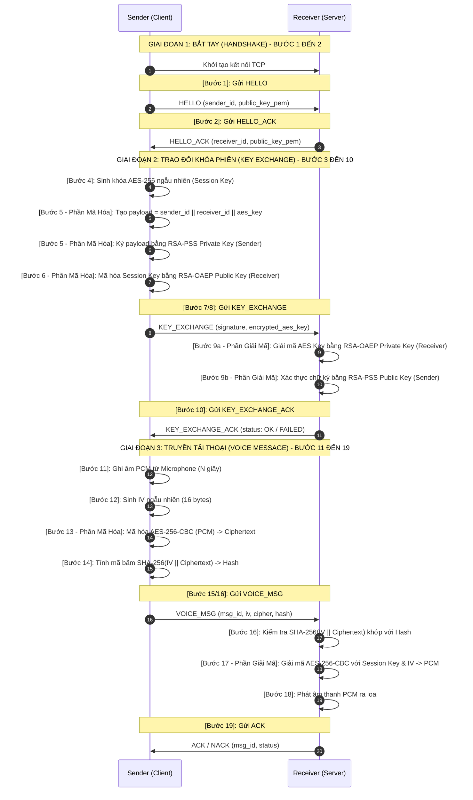

# 🎙️ SecureVoiceChat - Hệ Thống Nhắn Tin Âm Thanh Bảo Mật P2P

[](#)
[](#)
[](#)

SecureVoiceChat là ứng dụng gửi tin nhắn âm thanh bảo mật hoạt động theo mô hình Peer-to-Peer (P2P). Hệ thống triển khai các giao thức mật mã học lai (Hybrid Cryptography) hiện đại và chặt chẽ nhằm bảo vệ toàn diện dữ liệu truyền tải trước các nguy cơ tấn công mạng.

---

## 📖 Mục lục

1. [Tính Năng Bảo Mật Cốt Lõi](#-1-tính-năng-bảo-mật-cốt-lõi)
2. [Thông Số Kỹ Thuật Mật Mã](#-2-thông-số-kỹ-thuật-mật-mã)
3. [Luồng Xử Lý & Sơ Đồ Sequence Chi Tiết](#-3-luồng-xử-lý--sơ-đồ-sequence-chi-tiết)
4. [Kiến Trúc Module & Cấu Trúc File](#-4-kiến-trúc-module--cấu-trúc-file)
5. [Phân Tích Đe Dọa & Đối Phó](#-5-phân-tích-đe-dọa--đối-phó)
6. [Các Biện Pháp Bảo Mật Bổ Sung](#-6-các-biện-pháp-bảo-mật-bổ-sung)
7. [Cài Đặt & Hướng Dẫn Vận Hành](#-7-cài-đặt--hướng-dẫn-vận-hành)
8. [Xử Lý Sự Cố (Troubleshooting)](#-8-xử-lý-sự-cố-troubleshooting)

---

## 🛡️ 1. Tính Năng Bảo Mật Cốt Lõi

Hệ thống được thiết kế để đảm bảo ba nguyên tắc bảo mật thông tin cơ bản (**C-I-A**) cùng các tính năng chống giả mạo nâng cao:

*   **Confidentiality (Tính bí mật):** Dữ liệu âm thanh được mã hóa đối xứng qua thuật toán **AES-256-CBC**. Khóa phiên (Session Key) được bảo vệ bằng cơ chế mã hóa bất đối xứng **RSA-2048 (RSA-OAEP)**.
*   **Integrity (Tính toàn vẹn):** Ngăn chặn mọi hành vi sửa đổi dữ liệu truyền đi trên đường truyền mạng nhờ mã băm kiểm tra **SHA-256(IV || ciphertext)** trên từng gói tin nhắn thoại.
*   **Authenticity (Tính xác thực):** Xác minh danh tính người gửi bằng chữ ký số bất đối xứng sử dụng thuật toán **RSA-PSS** kết hợp hàm băm **SHA-256**.
*   **Anti-Replay (Chống tấn công phát lại):** Mỗi thông điệp gửi đi đi kèm một định danh duy nhất UUID (`msg_id`), kết hợp cơ chế hết hạn phiên làm việc (Session Timeout) trong vòng 5 phút.

---

## ⚙️ 2. Thông Số Kỹ Thuật Mật Mã

| Cơ chế bảo mật | Thuật toán / Đặc tả kỹ thuật | Mục tiêu kiểm soát |
| :--- | :--- | :--- |
| **Mã hóa dữ liệu lớn** | AES-256-CBC (PKCS7 Padding) | Bảo mật âm thanh thoại |
| **Trao đổi khóa bất đối xứng** | RSA-2048 (OAEP Padding + SHA-256) | Truyền tải Session Key an toàn |
| **Chữ ký số** | RSA-PSS (Salt len: digest, SHA-256) | Xác thực thực thể gửi và thông tin |
| **Kiểm tra tính toàn vẹn** | SHA-256 (IV \|\| Ciphertext) | Chống sửa đổi/xâm nhập trái phép |
| **Kích thước khóa đối xứng** | 256 bits (32 bytes ngẫu nhiên) | Khóa bảo mật đối xứng phiên |
| **Initialization Vector (IV)** | 128 bits (16 bytes ngẫu nhiên) | Tăng tính ngẫu nhiên của CBC mode |

---

## 📊 3. Luồng Xử Lý & Sơ Đồ Sequence Chi Tiết

Quá trình giao tiếp giữa **Sender** và **Receiver** diễn ra qua 3 giai đoạn chính gồm tổng cộng 19 bước chi tiết được đồng bộ tương ứng trong comment mã nguồn của [sender.py](sender.py) và [receiver.py](receiver.py).

### 3.1. Sơ đồ Sequence (Sequence Diagram)



### 3.2. Chi Tiết Từng Giai Đoạn Hoạt Động

#### Giai đoạn 1: Bắt tay (Handshake) - [Bước 1 đến 2]
Nhằm thiết lập phiên kết nối TCP và giúp hai bên trao đổi Public Key RSA của đối phương.
1. **[SENDER] - Bước 1**: Tạo cặp khóa RSA-2048 tạm thời cho phiên làm việc. Gửi gói tin `HELLO` chứa `sender_id` cùng Public Key của Sender sang bên nhận.
2. **[RECEIVER] - Bước 2**: Nhận `HELLO`, lưu trữ Public Key của Sender. Đồng thời sinh cặp khóa RSA-2048 của Receiver và trả lại gói tin `HELLO_ACK` chứa `receiver_id` cùng Public Key của Receiver.
3. Cả hai bên ghi nhận Public Key của nhau thành công.

#### Giai đoạn 2: Trao đổi khóa phiên (Key Exchange) - [Bước 3 đến 10]
Sinh và truyền tải khóa phiên AES an toàn, kết hợp xác thực chữ ký để chống giả mạo.
1. **[SENDER] - Bước 4**: Sinh ngẫu nhiên Session Key dài 256 bits (32 bytes) dùng riêng cho phiên truyền dữ liệu âm thanh này.
2. **[SENDER] - Bước 5 [Phần Mã Hóa]**:
   - Ghép chuỗi định danh: `payload = sender_id + receiver_id + aes_key`.
   - Thực hiện ký số bằng **Private Key của Sender** trên `payload` sử dụng thuật toán **RSA-PSS** kết hợp hash **SHA-256** tạo ra `signature`.
3. **[SENDER] - Bước 6 [Phần Mã Hóa]**:
   - Sử dụng **Public Key của Receiver** để mã hóa khóa AES-256 bằng thuật toán **RSA-OAEP** kết hợp hash **SHA-256** tạo ra `encrypted_aes_key`.
4. **[SENDER] - Bước 7**: Đóng gói `signature` và `encrypted_aes_key` gửi đi thông qua gói tin `KEY_EXCHANGE`.
5. **[RECEIVER] - Bước 8**: Nhận được gói tin `KEY_EXCHANGE`.
6. **[RECEIVER] - Bước 9a [Phần Giải Mã]**:
   - Sử dụng **Private Key của Receiver** để giải mã trường `encrypted_aes_key` bằng thuật toán **RSA-OAEP** nhằm khôi phục khóa AES-256 ban đầu.
7. **[RECEIVER] - Bước 9b [Phần Giải Mã]**:
   - Ghép lại `payload = sender_id + receiver_id + aes_key`.
   - Sử dụng **Public Key của Sender** xác thực chữ ký số `signature` trên `payload` thông qua thuật toán **RSA-PSS**.
8. **[RECEIVER] - Bước 10**: Nếu chữ ký hợp lệ và giải mã thành công, lưu lại khóa AES-256 và phản hồi gói tin `KEY_EXCHANGE_ACK` với trạng thái `OK`. Ngược lại, trả về lỗi.

#### Giai đoạn 3: Truyền tải thoại (Voice Message) - [Bước 11 đến 19]
Ghi âm, mã hóa và truyền tải dữ liệu thoại, kiểm tra tính toàn vẹn gói tin.
1. **[SENDER] - Bước 11**: Thu âm từ microphone thu về dữ liệu âm thanh raw PCM (16-bit, 44.1kHz, Mono).
2. **[SENDER] - Bước 12**: Sinh ngẫu nhiên Initialization Vector (IV) kích thước 16 bytes.
3. **[SENDER] - Bước 13 [Phần Mã Hóa]**: Mã hóa dữ liệu âm thanh raw PCM bằng khóa AES-256 phiên cùng IV ngẫu nhiên theo chế độ **AES-256-CBC**.
4. **[SENDER] - Bước 14**: Tính mã băm **SHA-256** của chuỗi dữ liệu ghép nối `(IV || ciphertext)` để đảm bảo tính toàn vẹn cho gói tin.
5. **[SENDER] - Bước 15**: Gửi gói tin `VOICE_MSG` bao gồm `msg_id` (UUID), `iv`, `cipher` và `hash` sang Receiver.
6. **[RECEIVER] - Bước 16**: Nhận gói tin `VOICE_MSG`. Tính toán lại mã băm **SHA-256** từ `(IV || cipher)` nhận được và so khớp với trường `hash`. Nếu không trùng khớp, từ chối gói tin ngay lập tức bằng phản hồi `NACK` (lỗi `INTEGRITY_ERROR`).
7. **[RECEIVER] - Bước 17 [Phần Giải Mã]**: Nếu dữ liệu toàn vẹn, sử dụng khóa đối xứng AES-256 đã nhận ở giai đoạn 2 kết hợp IV để giải mã `cipher` về dạng raw PCM ban đầu.
8. **[RECEIVER] - Bước 18**: Đưa luồng PCM giải mã thành công ra thiết bị phát âm thanh (Loa).
9. **[RECEIVER] - Bước 19**: Gửi gói tin phản hồi `ACK` báo hiệu xử lý thành công tới Sender.

---

## 📁 4. Kiến Trúc Module & Cấu Trúc File

Dự án được phân rã thành các module chuyên biệt với nhiệm vụ rõ ràng:

*   **[crypto_utils.py](crypto_utils.py):** Thư viện hàm mật mã thuần túy. Xử lý toàn bộ logic liên quan đến sinh khóa, mã hóa đối xứng (AES-256-CBC), mã hóa bất đối xứng (RSA OAEP/PSS) và băm kiểm tra (SHA-256).
*   **[crypto_engine.py](crypto_engine.py):** Lớp đóng gói `CryptoEngine` để đơn giản hóa giao diện lập trình cho Sender/Receiver, quản lý trạng thái các khóa RSA/AES hiện tại của phiên giao tiếp.
*   **[audio_handler.py](audio_handler.py):** Wrapper điều khiển phần cứng âm thanh bằng thư viện PyAudio, thực hiện ghi âm từ microphone và phát trực tiếp luồng bytes PCM ra loa.
*   **[protocol.py](protocol.py):** Định nghĩa cấu trúc, định dạng chuẩn cho các gói tin JSON truyền tải qua môi trường mạng (`HELLO`, `KEY_EXCHANGE`, `VOICE_MSG`, `ACK`/`NACK`).
*   **[sender.py](sender.py):** Trình diễn luồng logic hoạt động phía Client gửi dữ liệu (`VoiceSender`).
*   **[receiver.py](receiver.py):** Trình diễn luồng logic hoạt động phía Server nhận dữ liệu (`VoiceReceiver`).
*   **[main.py](main.py):** Giao diện đồ họa (GUI) xây dựng trên nền Tkinter, cho phép khởi chạy đồng thời cả hai client gửi/nhận trực quan trên màn hình.
*   **[test_integration.py](test_integration.py):** Script tự động chạy kiểm thử tích hợp (integration tests) liên thông tất cả các bước của giao thức mà không cần thiết bị microphone hay loa thật (được giả lập mock dữ liệu).

---

## 🎯 5. Phân Tích Đe Dọa & Đối Phó

| Nguy cơ (Threat Vectors) | Mô tả nguy cơ | Cơ chế đối phó (Countermeasures) | Chi tiết kỹ thuật |
| :--- | :--- | :--- | :--- |
| **Eavesdropping (Nghe lén)** | Kẻ tấn công sniffer dữ liệu trên đường truyền internet để lấy thông tin âm thanh. | **Mã hóa AES-256-CBC + RSA-OAEP** | Luồng dữ liệu âm thanh luôn được mã hóa đối xứng qua AES. Khóa AES chỉ truyền đi khi đã được bọc bởi RSA-OAEP bằng Public Key của người nhận. |
| **MitM (Giữa đường chặn)** | Kẻ tấn công giả danh người nhận hoặc người gửi để thiết lập khóa phiên giả. | **Xác thực chữ ký RSA-PSS** | Mỗi gói tin khóa trao đổi đều có chữ ký số RSA-PSS đi kèm. Kẻ tấn công không thể giả mạo chữ ký nếu không có Private Key của người gửi thực tế. |
| **Tampering (Sửa đổi dữ liệu)** | Kẻ tấn công thay đổi nội dung byte âm thanh hoặc phá hoại gói tin. | **Kiểm tra tính toàn vẹn SHA-256** | Trước khi giải mã, Receiver tính lại hash SHA-256 của toàn bộ gói dữ liệu nhận được và đối chiếu với hash đi kèm. Sai lệch sẽ lập tức bị hủy bỏ và trả về `NACK`. |
| **Replay Attack (Phát lại)** | Kẻ tấn công ghi lại gói tin thoại cũ hợp lệ và gửi lại để nghe lại hoặc spam. | **UUID unique + Session Expiry** | Mỗi tin nhắn mang một `msg_id` dạng UUID v4 ngẫu nhiên, không thể tái sử dụng. Kết nối sẽ bị hủy bỏ (timeout) nếu vượt quá 5 phút nhàn rỗi. |

---

## 🔒 6. Các Biện Pháp Bảo Mật Bổ Sung

### 6.1. Chống phân mảnh TCP bằng 4-byte Header (Framing)
TCP là một giao thức hướng luồng (stream-oriented), nghĩa là dữ liệu gửi đi có thể bị phân mảnh hoặc gộp thành một gói lớn ở tầng truyền tải. Để đảm bảo phía nhận đọc trọn vẹn và chính xác cấu trúc gói tin dạng JSON:
*   Mọi gói dữ liệu gửi đi đều được Sender/Receiver tính toán độ dài trước.
*   Gắn thêm **4 bytes header** chứa độ dài (big-endian integer) vào đầu gói tin.
*   Bên nhận luôn đọc chính xác 4 bytes trước để xác định độ dài gói, sau đó mới đọc đủ số bytes đó để giải mã JSON, giúp tránh triệt để lỗi mất dữ liệu hoặc gộp gói tin.

### 6.2. Giới hạn thời gian phiên (Session Timeout)
Để tránh rò rỉ khóa hoặc chiếm dụng tài nguyên kết nối nhàn rỗi:
*   Cả hai bên đều lưu mốc thời gian hoạt động cuối cùng `last_activity`.
*   Một tiến trình kiểm tra chạy nền sẽ so sánh thời gian thực tế. Nếu không có bất kỳ tin nhắn thoại nào được trao đổi trong vòng **5 phút (300 giây)**, phiên làm việc sẽ tự động chấm dứt (`timeout`).
*   Khi cần truyền lại, hệ thống yêu cầu thực hiện lại bắt tay từ đầu và sinh khóa AES hoàn toàn mới.

---

## 💻 7. Cài Đặt & Hướng Dẫn Vận Hành

### 7.1. Cài đặt Thư viện Phụ thuộc (Dependencies)
Dự án sử dụng Python 3.8+ và yêu cầu thư viện ngoại vi hỗ trợ phần cứng âm thanh và mã hóa.

**1. Cài đặt thư viện hệ thống cho PyAudio (nếu cần):**
*   **Windows**: Không cần cài đặt thư viện hệ thống, PyAudio đã đi kèm pre-compiled binaries.
*   **macOS**: Cài đặt PortAudio qua Homebrew:
    ```bash
    brew install portaudio
    ```
*   **Linux (Ubuntu/Debian)**: Cài đặt qua apt-get:
    ```bash
    sudo apt-get install portaudio19-dev python3-pyaudio
    ```

**2. Tạo Môi trường ảo & Cài đặt requirements.txt:**
```bash
# Khởi tạo virtual environment
python -m venv venv

# Kích hoạt môi trường ảo
# Trên Windows (PowerShell):
.\venv\Scripts\Activate.ps1
# Trên Linux/macOS:
source venv/bin/activate

# Cài đặt các thư viện phụ thuộc
pip install -r requirements.txt
```

### 7.2. Chạy ứng dụng qua Giao diện Đồ họa (GUI)
Để chạy thử nghiệm nhanh chóng, hãy sử dụng giao diện đồ họa Tkinter được tích hợp sẵn:
```bash
python main.py
```
Ứng dụng sẽ tự động mở đồng thời **2 cửa sổ độc lập** đại diện cho **Receiver** và **Sender** trên màn hình:

#### Thao tác trên cửa sổ Receiver (Màu xanh dương - Trái):
1. Nhấn nút **"👂 Lắng nghe"** để chuyển sang trạng thái chờ kết nối mạng trên IP `127.0.0.1` cổng mặc định `9000`.
2. Khi kết nối thành công từ Sender, giao diện tự động cập nhật và log bảo mật sẽ hiển thị các bước bắt tay & trao đổi khóa.
3. Khi nhận được tin nhắn âm thanh, Receiver tự động xác minh hash toàn vẹn, giải mã đối xứng và phát âm thanh ra loa.
4. Nhấn **"🔄 Reset"** để ngắt kết nối và bắt đầu lắng nghe lại từ đầu.

#### Thao tác trên cửa sổ Sender (Màu xanh lá - Phải):
1. Nhấn nút **"🔗 Kết nối"** để thực hiện liên kết TCP với Receiver và chạy tự động các bước Handshake & Key Exchange bảo mật.
2. Sau khi hiển thị trạng thái "Đã kết nối mã hóa", nhấn **"🎙️ Ghi âm"** để bắt đầu thu âm từ Microphone.
3. Nhấn **"⏹ Dừng"** để hoàn thành quá trình thu âm.
4. Nhấn **"📨 Gửi"** để thực hiện mã hóa AES-256-CBC, tính toán hash toàn vẹn SHA-256 và truyền tải qua mạng.
5. Nhấn **"🔄 Reset"** để ngắt kết nối hiện tại để thiết lập một phiên làm việc mới.

### 7.3. Chạy ứng dụng qua Dòng lệnh CLI (Command Line Interface)
Nếu muốn chạy riêng biệt trên hai terminal hoặc hai thiết bị mạng khác nhau:

**Terminal 1 — Khởi động Receiver:**
```bash
python receiver.py 127.0.0.1 9000
```

**Terminal 2 — Khởi động Sender:**
```bash
# Tham số: python sender.py <IP_RECEIVER> <PORT> [Thời_Gian_Ghi_Âm_Giây]
python sender.py 127.0.0.1 9000 5
```

---

## 🛠️ 8. Xử Lý Sự Cố (Troubleshooting)

*   **Lỗi 1: `ImportError` hoặc không thể import module `pyaudio`**
    *   *Nguyên nhân:* Thư viện hệ thống `PortAudio` chưa được cài đặt hoặc thiếu các file header phát triển.
    *   *Khắc phục:* Xem lại phần cài đặt thư viện hệ thống ở mục 7.1 đối với từng hệ điều hành tương ứng. Đối với Windows, nếu cài bằng pip thất bại, bạn có thể tải về file wheel `.whl` thích hợp từ các trang phân phối không chính thức và cài đặt thủ công.
*   **Lỗi 2: `OSError: [Errno -9996] Invalid number of channels` hoặc `No Default Input Device Found`**
    *   *Nguyên nhân:* Hệ thống không tìm thấy thiết bị Microphone khả dụng hoặc Microphone đang bị khóa quyền truy cập bởi quyền riêng tư của OS.
    *   *Khắc phục:* Đảm bảo Microphone đã được cắm vào thiết bị của bạn và quyền truy cập ứng dụng Microphone trong Windows/macOS Settings đã được kích hoạt.
*   **Lỗi 3: `ConnectionRefusedError: [Errno 10061] Connection refused`**
    *   *Nguyên nhân:* Trình gửi (Sender) được khởi chạy trước khi Trình nhận (Receiver) mở cổng lắng nghe.
    *   *Khắc phục:* Luôn luôn chạy Receiver và nhấn nút **Lắng nghe** trước khi mở kết nối từ Sender.
*   **Lỗi 4: `OSError: [Errno 98] Address already in use` hoặc `Errno 10048`**
    *   *Nguyên nhân:* Cổng kết nối TCP `9000` đang bị sử dụng bởi một tiến trình khác trên hệ thống.
    *   *Khắc phục:* Tắt tiến trình cũ hoặc cấu hình lại cổng mạng khác khả dụng trong mã nguồn chạy CLI.

---

> [!NOTE]
> Hệ thống này hoạt động tối ưu trên mạng LAN hoặc mạng nội bộ. Khi triển khai qua internet, hãy đảm bảo cổng mạng (Port) tương ứng đã được mở và không bị chặn bởi tường lửa (Firewall).

---
*Tài liệu hướng dẫn này được cập nhật đầy đủ và đồng bộ hoàn toàn với logic mã nguồn hiện tại.*