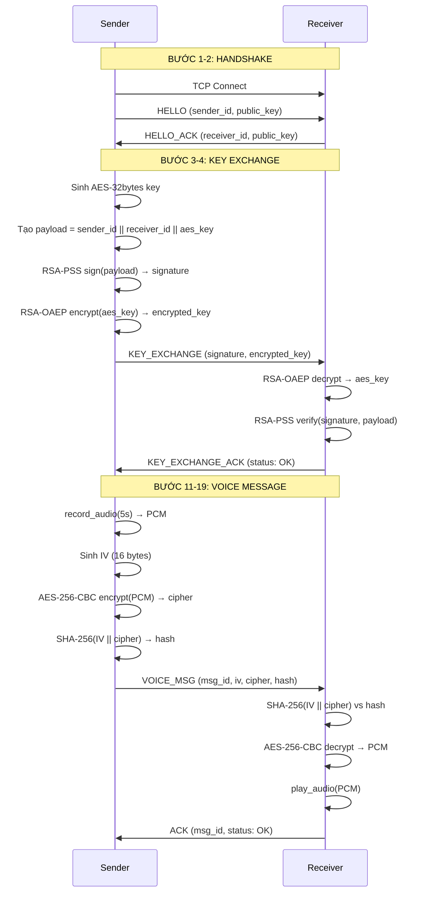

# SecureVoiceChat - Hệ Thống Nhắn Tin Âm Thanh Bảo Mật P2P

## Đề tài 17: Ứng dụng bảo mật tin nhắn âm thanh

Dự án này xây dựng hệ thống chat âm thanh bảo mật P2P, đáp ứng đầy đủ yêu cầu:
- Mã hóa AES-256 (CBC mode) cho dữ liệu âm thanh
- Trao đổi khóa RSA-2048 với RSA-OAEP
- Ký số/ xác thực bằng RSA-PSS + SHA-256
- Kiểm tra tính toàn vẹn bằng SHA-256(IV || ciphertext)
- Handshake ban đầu với "Start Voice Chat" / "Connection Accepted"
- Gửi gói tin `VOICE_MSG` gồm `iv`, `cipher`, `hash`
- Receiver trả `ACK` hoặc `NACK`

## Mục Lục

1. [Tổng Quan Hệ Thống](#1-tổng-quan-hệ-thống)
2. [Kiến Trúc Module](#2-kiến-trúc-module)
3. [Thông Số Mật Mã](#3-thông-số-mật-mã)
4. [Sơ Đồ Luồng Xử Lý](#4-sơ-đồ-luồng-xử-lý)
5. [Phân Tích Bảo Mật](#5-phân-tích-bảo-mật)
6. [Hướng Dẫn Chạy Thử](#6-hướng-dẫn-chạy-thử)
7. [Cài Đặt Dependencies](#7-cài-đặt-dependencies)

---

## 1. Tổng Quan Hệ Thống

**SecureVoiceChat** là hệ thống truyền tin nhắn âm thanh mã hóa end-to-end trong mạng P2P, đảm bảo ba yếu tố bảo mật CIA:

| Yếu Tố | Mô Tả |
|--------|-------|
| **Confidentiality** | Mã hóa AES-256-CBC + RSA-OAEP |
| **Integrity** | Kiểm tra SHA-256(iv \|\| ciphertext) |
| **Authenticity** | Chữ ký số RSA-PSS |

---

## 2. Kiến Trúc Module

```
SecureVoiceChat/
├── crypto_utils.py    # Hàm mật mã thuần túy
├── audio_handler.py   # Xử lý âm thanh (ghi/phát)
├── protocol.py        # Định nghĩa JSON message
├── sender.py         # Class VoiceSender
├── receiver.py       # Class VoiceReceiver
├── main.py           # CLI entry point
└── requirements.txt  # Dependencies
```

### Module 1: crypto_utils.py

Chứa toàn bộ hàm mật mã thuần túy:

| Hàm | Mô Tả |
|-----|-------|
| `generate_rsa_keypair()` | Sinh cặp khóa RSA-2048 |
| `serialize_public_key(pub_key)` | Serialize public key thành PEM |
| `load_public_key(pem_bytes)` | Load public key từ PEM |
| `rsa_encrypt(pub_key, data)` | Mã hóa RSA-OAEP+SHA256 |
| `rsa_decrypt(priv_key, data)` | Giải mã RSA-OAEP+SHA256 |
| `rsa_sign(priv_key, message)` | Ký RSA-PSS+SHA256 |
| `rsa_verify(pub_key, message, signature)` | Xác thực RSA-PSS |
| `aes_encrypt(key, iv, plaintext)` | Mã hóa AES-256-CBC+PKCS7 |
| `aes_decrypt(key, iv, ciphertext)` | Giải mã AES-256-CBC |
| `compute_hash(iv, ciphertext)` | Tính SHA-256 hash |
| `verify_hash(iv, ciphertext, expected_hash)` | Xác thực hash |

### Module 2: audio_handler.py

Xử lý âm thanh:

| Hàm | Mô Tả |
|-----|-------|
| `record_audio(duration_sec, sample_rate)` | Ghi âm PCM từ microphone |
| `play_audio(pcm_bytes, sample_rate)` | Phát âm thanh PCM |
| `bytes_to_base64(data)` | Chuyển bytes sang base64 |
| `base64_to_bytes(data)` | Chuyển base64 sang bytes |

### Module 3: protocol.py

Định nghĩa cấu trúc JSON message:

```python
# HANDSHAKE
HELLO = {"type": "HELLO", "sender_id": "<uuid>", "public_key": "<PEM base64>"}
HELLO_ACK = {"type": "HELLO_ACK", "receiver_id": "<uuid>", "public_key": "<PEM base64>"}

# KEY EXCHANGE
KEY_EXCHANGE = {"type": "KEY_EXCHANGE", "signed_info": "<base64>", "encrypted_aes_key": "<base64>"}
KEY_EXCHANGE_ACK = {"type": "KEY_EXCHANGE_ACK", "status": "OK|FAILED", "reason": ""}

# VOICE MESSAGE
VOICE_MSG = {"type": "VOICE_MSG", "msg_id": "<uuid>", "iv": "<base64>", "cipher": "<base64>", "hash": "<hex>"}

# ACK/NACK
ACK = {"type": "ACK", "msg_id": "<uuid>", "status": "OK"}
NACK = {"type": "NACK", "msg_id": "<uuid>", "status": "FAILED", "reason": "INTEGRITY_ERROR|DECRYPT_ERROR"}
```

### Module 4: sender.py

Class `VoiceSender`:

```python
class VoiceSender:
    def __init__(self, host, port, sender_id)
    def connect()           # TCP connect
    def handshake()         # Bước 1-2: HELLO + HELLO_ACK
    def exchange_key()      # Bước 3-4: KEY_EXCHANGE
    def send_voice(duration)# Bước 11-19: Ghi âm → Mã hóa → Gửi → Chờ ACK
    def close()             # Đóng kết nối
```

### Module 5: receiver.py

Class `VoiceReceiver`:

```python
class VoiceReceiver:
    def __init__(self, host, port, receiver_id)
    def listen()            # Bind & Accept TCP
    def handshake()         # Bước 1-2: Nhận HELLO → Gửi HELLO_ACK
    def receive_key()       # Bước 8-10: Nhận KEY_EXCHANGE → Giải mã → Xác thực
    def receive_voice()     # Bước 16-19: Nhận → Kiểm tra hash → Giải mã → Phát → Gửi ACK
    def close()             # Đóng kết nối
```

### Module 6: main.py

CLI entry point:

```bash
python main.py --mode sender|receiver --host <ip> --port <port> --duration <seconds>
```

---

## 3. Thông Số Mật Mã

| Thông Số | Giá Trị |
|----------|---------|
| Mã hóa đối xứng | AES-256, CBC mode, PKCS7 padding |
| Mã hóa bất đối xứng | RSA-2048 |
| Trao khóa | OAEP padding + SHA-256 |
| Ký số | PSS padding + SHA-256 |
| Kiểm tra toàn vẹn | SHA-256(IV \|\| ciphertext) |
| Khóa AES phiên | 32 bytes ngẫu nhiên (`os.urandom(32)`) |
| IV | 16 bytes ngẫu nhiên (`os.urandom(16)`) |

---

## 4. Sơ Đồ Luồng Xử Lý

### Sequence Diagram



### Luồng Xử Lý Chi Tiết

```
┌─────────────────────────────────────────────────────────────────────────┐
│                        SEQUENCE FLOW                                    │
├─────────────────────────────────────────────────────────────────────────┤
│                                                                          │
│  [SENDER]                           [RECEIVER]                          │
│     │                                    │                               │
│     │  1. Sinh RSA-2048 keypair          │                               │
│     │  2. Gửi HELLO + public_key         │                               │
│     ├───────────────────────────────────►│                               │
│     │                                    │  3. Sinh RSA-2048 keypair     │
│     │                                    │  4. Gửi HELLO_ACK + public_key │
│     │◄───────────────────────────────────┤                               │
│     │                                    │                               │
│     │  5. Sinh AES-32bytes session key  │                               │
│     │  6. Sign(sender_id||receiver_id|| │                               │
│     │            aes_key) with RSA-PSS  │                               │
│     │  7. Encrypt aes_key with RSA-OAEP  │                               │
│     │  8. Gửi KEY_EXCHANGE               │                               │
│     ├───────────────────────────────────►│                               │
│     │                                    │  9. Decrypt aes_key            │
│     │                                    │ 10. Verify RSA-PSS signature   │
│     │                                    │ 11. Gửi KEY_EXCHANGE_ACK      │
│     │◄───────────────────────────────────┤                               │
│     │                                    │                               │
│     │ 12. Ghi âm PCM (N giây)            │                               │
│     │ 13. Sinh IV (16 bytes)             │                               │
│     │ 14. AES-256-CBC encrypt           │                               │
│     │ 15. SHA-256(IV||cipher) → hash     │                               │
│     │ 16. Gửi VOICE_MSG                 │                               │
│     ├───────────────────────────────────►│                               │
│     │                                    │ 17. Verify SHA-256 hash       │
│     │                                    │ 18. AES-256-CBC decrypt       │
│     │                                    │ 19. Phát âm thanh             │
│     │                                    │ 20. Gửi ACK                  │
│     │◄───────────────────────────────────┤                               │
│     │                                    │                               │
└─────────────────────────────────────────────────────────────────────────┘
```

---

## 5. Phân Tích Bảo Mật

### 5.1 Các Vector Tấn Công Được Ngăn Chặn

| Vector Tấn Công | Cơ Chế Ngăn Chặn | Chi Tiết |
|-----------------|------------------|----------|
| **Replay Attack** | msg_id (UUID unique) | Mỗi tin nhắn có UUID unique, không thể tái sử dụng |
| **Man-in-the-Middle** | RSA signature xác thực | Chữ ký RSA-PSS xác thực identity của cả hai bên |
| **Eavesdropping** | AES-256 + RSA key exchange | Dữ liệu mã hóa end-to-end, không thể đọc được |
| **Tampering** | SHA-256 integrity hash | Hash kiểm tra toàn vẹn IV + cipher |

### 5.2 Tại Sao Chọn CBC Mode Thay Vì GCM?

**Lý do chọn CBC mode:**

1. **Tương thích rộng rãi**: CBC được hỗ trợ rộng rãi hơn trên các thư viện mật mã
2. **Đơn giản triển khai**: CBC dễ hiểu và dễ triển khai hơn GCM
3. **Không cần authentication tag**: GCM yêu cầu thêm authentication, chúng ta đã có SHA-256 hash riêng cho integrity
4. **Padding PKCS7**: Đã có cơ chế padding an toàn

**Lưu ý bảo mật:**
- GCM có built-in authentication nhưng yêu cầu quản lý nonce phức tạp hơn
- Với hệ thống này, SHA-256 hash đã cung cấp integrity check đầy đủ
- CBC + SHA-256 là lựa chọn phù hợp cho use case P2P voice messaging

### 5.3 Các Biện Pháp Bảo Mật Bổ Sung

```python
# 1. Session Timeout (5 phút)
def check_session_timeout(self, timeout_seconds: int = 300):
    elapsed = time.time() - self.last_activity
    if elapsed > timeout_seconds:
        return True  # Session expired
    return False

# 2. Message ID unique (ngăn replay)
msg_id = str(uuid.uuid4())  # UUID4 = random

# 3. Error handling đầy đủ
try:
    # Xử lý mã hóa/giải mã
except Exception as e:
    # Gửi NACK với lý do cụ thể
    self._send_message(create_nack(msg_id, "DECRYPT_ERROR"))
```

---

## 6. Hướng Dẫn Chạy Thử

### Bước 1: Cài Đặt Dependencies

```bash
pip install -r requirements.txt
```

### Bước 2: Chạy Receiver (Terminal 1)

```bash
python main.py --mode receiver --port 9000
```

Output mẫu:
```
============================================================
SecureVoiceChat - P2P Encrypted Voice Messaging
============================================================
Mode: receiver
Port: 9000
User ID: a1b2c3d4-...
============================================================

[MAIN] Starting receiver on port 9000...
[RECEIVER] Initialized with receiver_id: a1b2c3d4-...
[RECEIVER] Listening on :9000...
[RECEIVER] Server listening on port 9000
[RECEIVER] Waiting for connection...
```

### Bước 3: Chạy Sender (Terminal 2)

```bash
python main.py --mode sender --host 127.0.0.1 --port 9000 --duration 5
```

Output mẫu:
```
============================================================
SecureVoiceChat - P2P Encrypted Voice Messaging
============================================================
Mode: sender
Port: 9000
User ID: e5f6g7h8-...
============================================================

[MAIN] Starting sender to 127.0.0.1:9000...
[SENDER] Initialized with sender_id: e5f6g7h8-...
[SENDER] Connecting to 127.0.0.1:9000...
[SENDER] Connected to 127.0.0.1:9000
[SENDER] Starting handshake...
[SENDER] HELLO sent with sender_id: e5f6g7h8-...
[SENDER] HELLO_ACK received, receiver_id: a1b2c3d4-...
[SENDER] Handshake completed successfully
[SENDER] Starting key exchange...
[SENDER] AES session key generated: a1b2c3d4...
[SENDER] Payload signed with RSA-PSS
[SENDER] AES key encrypted with RSA-OAEP
[SENDER] KEY_EXCHANGE sent
[SENDER] KEY_EXCHANGE_ACK received: OK
[SENDER] Key exchange completed successfully
[SENDER] Recording voice for 5.0 seconds...
[AUDIO] Starting recording for 5.0 seconds...
[AUDIO] Recording completed. Total bytes: 441000
[SENDER] Audio recorded: 441000 bytes
[SENDER] IV generated: f1e2d3c4...
[SENDER] Audio encrypted with AES-256-CBC: 441024 bytes
[SENDER] Hash computed: 3a4b5c6d...
[SENDER] VOICE_MSG sent, msg_id: i9j0k1l2-...
[SENDER] Waiting for ACK/NACK...
[RECEIVER] HELLO received, sender_id: e5f6g7h8-...
[RECEIVER] Handshake completed successfully
[RECEIVER] Waiting for key exchange...
[RECEIVER] KEY_EXCHANGE received
[RECEIVER] AES key decrypted: a1b2c3d4...
[RECEIVER] Signature verified OK
[RECEIVER] KEY_EXCHANGE_ACK sent: OK
[RECEIVER] Key exchange completed successfully
[RECEIVER] Waiting for voice message...
[RECEIVER] VOICE_MSG received, msg_id: i9j0k1l2-...
[RECEIVER] Hash verified OK
[RECEIVER] Audio decrypted: 441000 bytes
[RECEIVER] Playing audio...
[AUDIO] Starting playback of 441000 bytes...
[AUDIO] Playback completed
[RECEIVER] ACK sent for msg_id: i9j0k1l2-...
[SENDER] ACK received for msg_id: i9j0k1l2-...
[SENDER] Voice message sent successfully!
[MAIN] Program completed successfully
```

---

## 7. Cài Đặt Dependencies

### requirements.txt

```
cryptography>=41.0.0
pyaudio>=0.2.14
```

### Cài Đặt

```bash
# Tạo virtual environment (khuyến nghị)
python -m venv venv
source venv/bin/activate  # Linux/Mac
# hoặc
venv\Scripts\activate     # Windows

# Cài đặt dependencies
pip install -r requirements.txt
```

### Lưu Ý

- **PyAudio** yêu cầu PortAudio library. Trên Windows, cần cài đặt [PortAudio v19](http://www.portaudio.com/download.html)
- Nếu gặp lỗi cài đặt PyAudio, thử: `pip install pyaudio==0.2.14`
- Trên Ubuntu/Debian: `sudo apt-get install portaudio19-dev python3-pyaudio`
- Trên macOS: `brew install portaudio`

---

## Bonus: Session Expiry (Tự Động Hết Hạn Sau 5 Phút)

Hệ thống đã tích hợp cơ chế timeout:

```python
# Trong sender.py và receiver.py
def check_session_timeout(self, timeout_seconds: int = 300) -> bool:
    """
    Kiểm tra phiên có timeout không (mặc định 5 phút).
    """
    elapsed = time.time() - self.last_activity
    if elapsed > timeout_seconds:
        print(f"[SESSION] Session timeout after {elapsed:.0f} seconds")
        return True
    return False
```

Khi session timeout:
1. Tự động đóng kết nối
2. Yêu cầu tái tạo AES session key mới
3. Thực hiện lại handshake

---

## Tóm Tắt

| Thành Phần | Mô Tả |
|------------|-------|
| **Mã hóa đối xứng** | AES-256-CBC + PKCS7 padding |
| **Mã hóa bất đối xứng** | RSA-2048 với OAEP/PSS |
| **Integrity** | SHA-256(iv \|\| ciphertext) |
| **Authentication** | RSA-PSS signature |
| **Protocol** | JSON over TCP |
| **Audio** | PCM 44100Hz, 16-bit, mono |

---

**Lưu ý quan trọng**: Hệ thống này chỉ hoạt động trong mạng LAN hoặc qua Internet với địa chỉ IP public. Cần đảm bảo firewall cho phép kết nối TCP trên cổng được sử dụng.